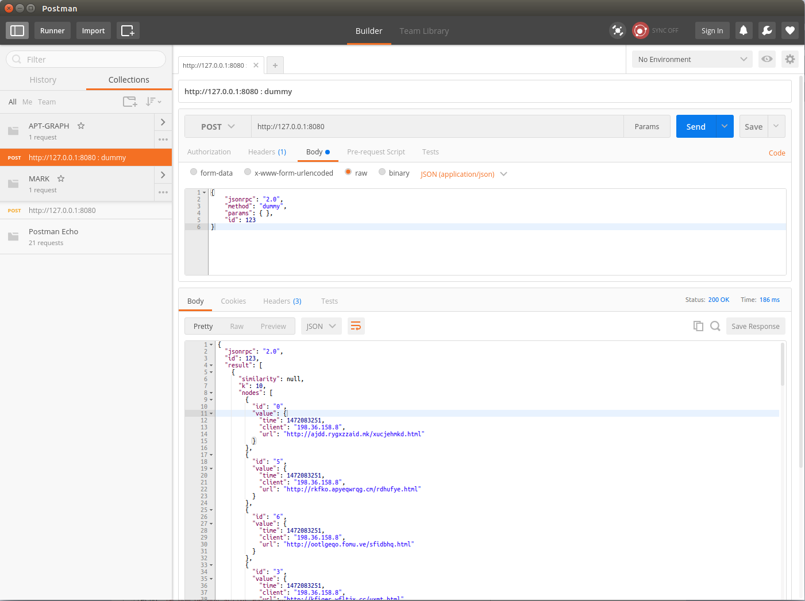

# APT-GRAPH

HTTP graph modeling for APT detection.

## Requirements
- java
- Apache Maven

## Maven modules
- **core** : contains classes used by the batch processor and the server (Request, etc.).
- **batch** : contains the batch processor
- **server** : contains the json-rpc server and interactive fusion engine

## Usage

```
# get the latest version from github
git pull

# build the core module
cd core
mvn clean install

# build and run the batch processor to build the graph
cd ../batch
mvn clean package
./batch.sh -i <proxy log file> -o <graph file>

# build and run the server
cd ../server
mvn clean package
./start.sh -i <graph file>

# by default, the server is available at http://127.0.0.1:8080

# There is a dummy graph file in folder src/test/resources
# hence you can make tests with
./start.sh -i ./src/test/resources/dummy_graph.ser


```

## Architecture

### Batch processor
- parses a proxy log file
- build one **requests k-nn graph** for each feature (time, url similarity, etc.)
- stores the graphs in a database

### UI
javascript UI that allows the user to choose:
- parameters for aggregating **request graphs** into **URL k-nn graphs**
- parameters for aggregating feature graphs into a single **combined graph** (simple version uses weighted average, a more evolved version might implement OWA or WOWA)
- prunning threshold for cutting low weight edges
- maximum cluster size for filtering resulting clusters

### Server
Exposes a json-rpc server that, based on user parameters, will:
- compute the **URL graphs**
- compute the **combined graph**
- **prune** the combined graph
- **cluster** the graph
- **filter** the clustered graph
- return the remaining nodes and edges

## Implemented RPC
### dummy

The **dummy** rpc returns a list of disconnected graphs (the clusters):
- Each graph consists of nodes and edges
- Each node has an id and a value
- the edges are represented as a hashmap that associates a source node and a destionation node

The example below contains one cluster of 7 nodes...

```
[
{
  "similarity": null,
  "k": 10,
  "nodes": [
    {
      "id": "0",
      "value": {
        "time": 1472083251,
        "client": "198.36.158.8",
        "url": "http://ajdd.rygxzzaid.mk/xucjehmkd.html"
      }
    },
    {
      "id": "5",
      "value": {
        "time": 1472083251,
        "client": "198.36.158.8",
        "url": "http://rkfko.apyeqwrqg.cm/rdhufye.html"
      }
    },
    {
      "id": "6",
      "value": {
        "time": 1472083251,
        "client": "198.36.158.8",
        "url": "http://ootlgeqo.fomu.ve/sfidbhq.html"
      }
    },
    {
      "id": "3",
      "value": {
        "time": 1472083251,
        "client": "198.36.158.8",
        "url": "http://kfiger.wfltjx.cc/uxmt.html"
      }
    },
    {
      "id": "4",
      "value": {
        "time": 1472083251,
        "client": "198.36.158.8",
        "url": "http://isogbg.hgwpxah.nz/roeefw.html"
      }
    },
    {
      "id": "1",
      "value": {
        "time": 1472083251,
        "client": "198.36.158.8",
        "url": "http://epnazrk.wmaj.ga/zlrsmtcc.html"
      }
    },
    {
      "id": "2",
      "value": {
        "time": 1472083251,
        "client": "198.36.158.8",
        "url": "http://epnazrk.wmaj.ga/zjeglwir.html"
      }
    }
  ],
  "hashMap": {
    "(0 => 1472083251\thttp://ajdd.rygxzzaid.mk/xucjehmkd.html 198.36.158.8)": [
      {
        "node": {
          "id": "6",
          "value": {
            "time": 1472083251,
            "client": "198.36.158.8",
            "url": "http://ootlgeqo.fomu.ve/sfidbhq.html"
          }
        },
        "similarity": 1
      },
      {
        "node": {
          "id": "3",
          "value": {
            "time": 1472083251,
            "client": "198.36.158.8",
            "url": "http://kfiger.wfltjx.cc/uxmt.html"
          }
        },
        "similarity": 1
      },
      {
        "node": {
          "id": "5",
          "value": {
            "time": 1472083251,
            "client": "198.36.158.8",
            "url": "http://rkfko.apyeqwrqg.cm/rdhufye.html"
          }
        },
        "similarity": 1
      },
      {
        "node": {
          "id": "1",
    ...
```

