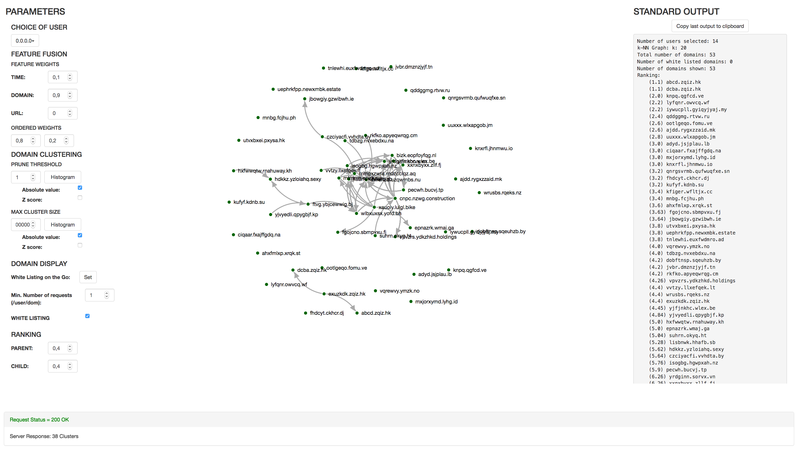
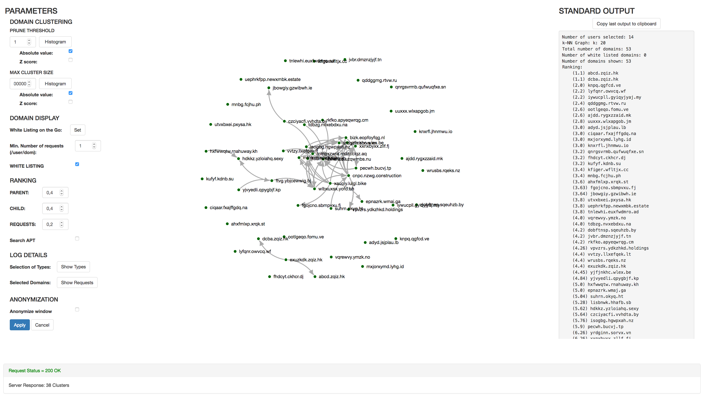

# APT-GRAPH

[](https://travis-ci.org/RUCD/apt-graph)
[](http://api123.io/api/apt-graph/head/index.html)
[](https://coveralls.io/github/RUCD/apt-graph?branch=master)

The focus of APT-GRAPH is the detection of Advanced Persistent Threat (APT). More specifically, the aim is to study proxy log files and to detect a domain used as Command and Control (C2) by an APT. The implemented algorithm models the traffic by means of a graph and tries to detect infections by looking for anomaly within the graph. The algorithm has been designed to work closely with an analyst. This analyst can work interactively with a set of parameters and adapt the algorithm to focus on a specific type of APT.


## Requirements

- Java 8
- Apache Maven


## Maven modules

### Main modules

- **apt-graph**: is the parent module. It allows the build and the testing of all the modules at once.
- **core**: defines Objects and Classes used by the Batch Processor and the Server. It mainly defines the similarities used to build the graphs.
- **batch**: contains the Batch Processor. The Batch Processor is the module of the algorithm preprocessing the data .
- **server**: contains the JSON-RPC Server. The Server gives access to a set of parameters. With these parameters the Server is able to interactively complete the processing of the graph and gives the results to the UI (using JSON-RPC).
- **website**: contains the UI (HTML/JavaScript). This UI lets the analyst choose parameters needed by the Server and gives a visualization of the results (computed graph and ranking list of suspicious domains).


### Auxiliary modules

- **integration**: checks that the Batch Processor and the Server work smoothly together.
- **infection**: is an additional tool to simulate infections in a provided proxy log file.
- **traffic**: is an additional tool to study the traffic intensity of a provided proxy log file.
- **study**: is an additional tool allowing an in depth impact study of a given parameter on the detection. This tool uses Receiver Operating Characteristics (ROC) to evaluate the impact.
- **config**: is an additional tool which helps to generate configuration files used by the study tool.


## Quick Start

Get the latest version from GitHub.
```
git clone https://github.com/RUCD/apt-graph.git
```

Build all the modules together.
```
cd apt-graph/apt-graph
mvn clean install
```

Run the Batch Processor to build the graphs.
```
cd ../batch
./analyze.sh -i <proxy log file> -o <graphs directory>
```

There is a test file in _batch/src/test/resources/_. Use the following command to check the Batch Processor with the test file:
```
./analyze.sh -i ./src/test/resources/1000_http_requests.txt -o /tmp/mytest/
```

Run the server.
```
cd ../server
./start.sh -i <graphs directory>
```

By default, the UI is available at http://127.0.0.1:8000 and the JSON-RPC Server is at http://127.0.0.1:8080.

There is a folder in _server/src/test/resources_/ containing dummy graphs. Use the following command to check the Server with these graphs:
```
./start.sh -i ./src/test/resources/dummyDir/
```

Connect to the UI using a browser (http://127.0.0.1:8000). Choose your parameters as shown on the screenshots below and click on "Apply" to get the result.

If everything is alright you should get something like this:






## Usage

### batch

```
./analyze.sh -h
usage: java -jar batch-<version>.jar
-c <arg>   Select only temporal children (option, default: true)
-f <arg>   Specify format of input file (squid or json) (option,
			default: squid)
-h         Show this help
-i <arg>   Input log file (required)
-k <arg>   Impose k value of k-NN graphs (option, default: 20)
-o <arg>   Output directory for graphs (required)
-x <arg>   Overwrite existing graphs (option, default: false)
```
The next command is typical to start the preprocessing:
```
./analyze.sh -i <proxy log file> -o <graphs directory> -k 50 -f squid
```


### server

```
./start.sh -h
usage: java -jar server-<version>.jar
-h             Show this help
-i <arg>       Input directory with graphs (required)
-study <arg>   Study output mode (false = web output, true = 
				study output) (option, default: false)
```
The next command is typical to start the Server:
```
./start.sh -i <graphs directory>
```


### infection

```
    ./infect.sh -h
    usage: java -jar infection-<version>.jar
     -d <arg>            APT domain name (required)
     -delay <arg>        Delay between start of the burst and injection
     					of APT (option for traffic APT, default:
						middle 
     					of the burst)
     -delta <arg>        Duration between two requests of the same
						burst (required for traffic APT)
     -distance <arg>     Minimal time distance between two
						injections (option for traffic APT, 
						default: no limitation)
     -duration <arg>     Minimal duration of a burst to allow APT
						injection (required for traffic APT)
     -f <arg>            Specify format of input file (squid
       					or json) (option, default: squid)
     -h                  Show this help
     -i <arg>            Input log file (required)
     -injection <arg>    Maximal daily number of injections
       					(option for traffic APT, default: no
						limitation)
     -o <arg>            Output log file (required)
     -proportion <arg>   Injection rate in the possible bursts
						(1 = inject in all possible bursts)
						(option for traffic APT, default: 1)
     -step <arg>         Specify time step between periodic injections
						in milliseconds (required for periodic APT)
     -t <arg>            Type (periodic or traffic) (required)
     -u <arg>            Targeted user or subnet (required)
```
The next command is typical to simulate a periodic infection:
```
./infect.sh -i <log file path> -o <output file path> -u <user ip> -d APT.FINDME.apt -t periodic -step 43200000
```
The next command is typical to simulate a traffic based infection:
```
./infect.sh -i <log file path> -o <output file path> -u <user ip> -d APT.FINDME.apt -t traffic -duration 5000 -delta 1000
```


### traffic

```
./traffic.sh -h
usage: java -jar traffic-<version>.jar
 -f <arg>   Specify format of input file (squid or json) (option, 
 			default: squid)
 -h         Show this help
 -i <arg>   Input log file (required)
 -o <arg>   Output CSV file (required)
 -r <arg>   Time resolution in milliseconds (required)
```
The next command is typical to compute a traffic histogram:
```
./traffic.sh -i <input log file> -o <output CSV file> -r 1000
```


### config

```
./config.sh -h
usage: java -jar config-<version>.jar
 -field <arg>   Configuration field to sweep (required)
 -h             Show this help
 -i <arg>       Input configuration file (default configuration line) 
 				(required)
 -multi <arg>   Sweep the given field as complement to stop value of 
 				the first field (option, default: no second field)
 -o <arg>       Output configuration file (required)
 -start <arg>   Start value of sweep (required)
 -step <arg>    Step of sweep (required)
 -stop <arg>    Stop value of sweep (required)
```

A typical default configuration line is: 

```
{"input_dir":"<input directory>",
"output_file":"<output file path>/ROC_anon.csv",
"n_apt_tot":"2","user":"108.142.213.0","feature_weights_time":"0.1",
"feature_weights_domain":"0.9","feature_weights_url":"0.0",
"feature_ordered_weights_1":"0.8","feature_ordered_weights_2":"0.2",
"prune_threshold":"0.00","max_cluster_size":"1000000",
"prune_z":"true","cluster_z":"false","whitelist":"true",
"white_ongo":"","number_requests":"5","ranking_weights_parents":"0.4",
"ranking_weights_children":"0.4","ranking_weights_requests":"0.2",
"apt_search":"true"}
```
The next command is typical to create a configuration file studying the pruning threshold:
```
./config.sh -i <default configuration file> -o <output configuration file> -field prune_threshold -start 0.0 -stop 1.0 -step 0.1
```


### study

```
./study.sh -h
usage: java -jar study-<version>.jar
 -h         Show this help
 -i <arg>   Input configuration file (required)
 -x <arg>   Overwrite existing files (option, default: false)
```
The next command is typical to produce several ROC based on the provided configuration file:
```
./study.sh -i <input configuration file>
```

## Data representation

### Request

The _Request_ Object contains all the needed information about a request. Two types of proxy log files are supported : _Squid_ and _JSON_.

The following example is a typical line of a _Squid_ format file :
```
1425971539.000   1364 108.142.226.170 TCP_NC_MISS/200 342 GET http://77efee5dcb3635e09435eb33a8351364.3da9819b747e806d78f83f22c703d178.an/59a543c185f3330a33a47736d6879e16 - -/146.159.80.113 image/gif
```

The following example is a typical line of a _JSON_ format file :
```
{"@version":"1","@timestamp":"2014-10-10T23:12:24.000Z","type":"proxy_fwd_iwsva","timestamp":"Sat, 11 Oct 2014 01:12:24,CEST","tk_username":"192.168.2.167","tk_url":"http://weather.service.msn.com/data.aspx?src=Windows7&amp;wealocations=wc:8040075&amp;weadegreetype=F&amp;culture=en-US","tk_size":0,"tk_date_field":"2014-10-11 01:12:24+0200","tk_protocol":"http","tk_mime_content":"text/xml","tk_client_ip":"192.168.2.167","tk_server_ip":"92.122.122.162","tk_domain":"weather.service.msn.com","tk_path":"data.aspx","tk_file_name":"data.aspx","tk_operation":"GET","tk_uid":"0271674894-29fe6b562438c1f7e996","tk_category":"40","tk_category_type":"0","geoip":{"ip":"92.122.122.162","country_code2":"EU","country_code3":"EU","country_name":"Europe","continent_code":"EU","latitude":47.0,"longitude":8.0,"location":[8.0,47.0]},"category":"Search Engines/Portals"}
```


### Domain

A _Domain_ Object is defined as a list of _Requests_. Each list has the related domain name as given name. The similarity between two domains is defined as the sum of the similarities between the requests of these domains.


### Graph

The graphs of requests build by the Batch Processor are k-NN graphs. All other graphs are general graphs. The implementation of the tools used to compute and process the graphs has been done in [java-graphs](https://github.com/tdebatty/java-graphs).


### Clusters

A graph of clusters is modeled as a list of graphs. Each of these graphs represents a cluster.


## Algorithm

### Core

The Core defines the similarities used to compute the k-NN graphs of each user. The used similarities are the following:

* Time similarity: 

 

 with  defined as the temporal difference between the request timestamps (in second).

* Domain name based similarity:

 

 with  defined as the number of common labels between the two domain names, starting from the Top Level Domain (TLD), TLD excluded but equal to each other;  defined as the maximum between the two label numbers of the domain names, TLD excluded.


​	e.g.: _edition.cnn.com_ and _cnn.com_ have ,  and 


### Batch Processor

The Batch Processor is composed of the following processing steps:
1. parse a proxy log file (squid or JSON format);
2. split the data by user;
3. build k-NN graph of requests for each similarity and each user;
4. select the children requests among the neighbour requests (optional)
5. compute graph of domains for each similarity and each user;
6. store all necessary data in graphs directory (user graphs (_ip.address.ser_, e.g.: _192.168.2.1.ser_), list of users (_users.ser_), list of subnets (_subnets.ser_), k value (_k.ser_)).


### Server

The Server is composed of the following processing steps:
1. load the data of users selected by the analyst (_ip.address.ser_, _users.ser_, _subnets.ser_, _k.ser_);
2. merge similarity graphs for each user using a weighted sum of similarities;
3. merge all user graphs using a sum of similarities;
4. prune the merged graph;
5. compute clusters in the graph (deprecated);
6. filter large clusters (deprecated);
7. clean the graph based on white listing (optional);
8. compute the rank list of suspicious domains.


### UI

The UI gives access to the following parameters:
* user or subnet;
* weights for fusion of the similarities;
* pruning threshold (absolute value or z-score);
* maximum cluster size (absolute value or z-score);
* white listing settings (optional): _on the go_ white listed domains, minimum number of requests by domain and by user;
* weights of ranking indexes.


## Further details

Documentation is available [here](http://api123.io/api/apt-graph/head/index.html). Further details can be found in the code itself, where each method has been documented. 


## License

Source code is released under [MIT license](http://mit-license.org/).
Read LICENSE file for more information.
